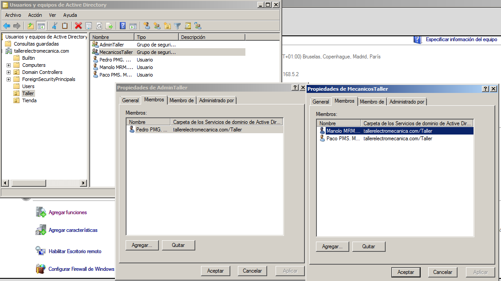
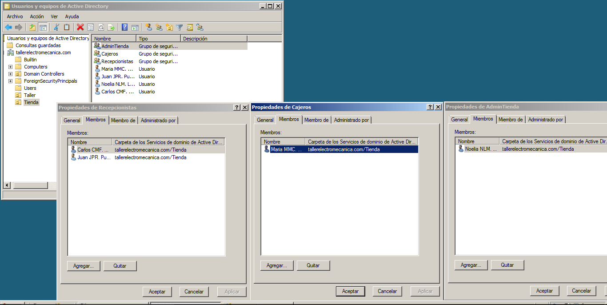
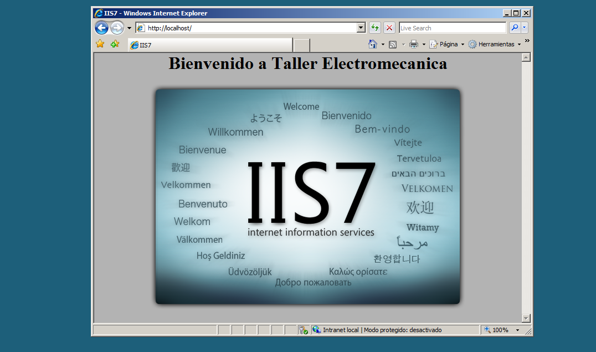

# ActiveDirectory

Se desea crear un active directory de una empresa llamada Taller Electromecanica el dominio debe ser tallerelectromecanica.com . 
Tambien se desea crear su pagina web.  
La empresa esta dividida en dos:  
Taller  
En el taller hay dos grupos los admins del taller y los mecanicos  
hay tres mecanicos en el taller  

Tienda  
La tienda se divide en 3 grupos, AdminTienda, Recepcionistas, Cajeros  
hay 4 personas  

web

